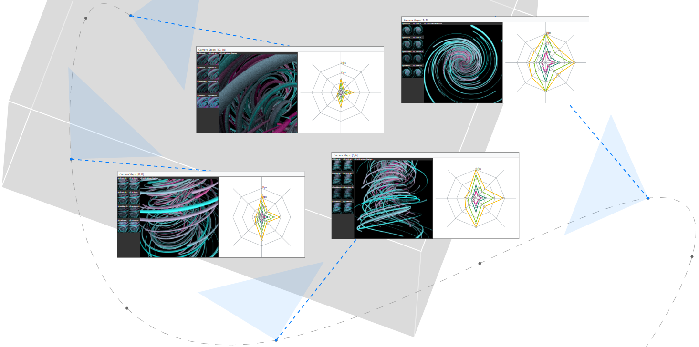

# Visually Comparing Rendering Performance from Multiple Perspectives

## Installation

**Note:** [Node 14](https://nodejs.org/download/release/v14.18.3/) is required to build and run!

First install necessary dependencies using

`yarn install`

and afterwards start the application by running

`yarn run serve`

## Required Datasets

The provided source code includes performance data for five datasets (see [/public](/public)), however: **none of the screenshots are included at the moment**. We are working on a solution to host the ~100 Gb of png images.